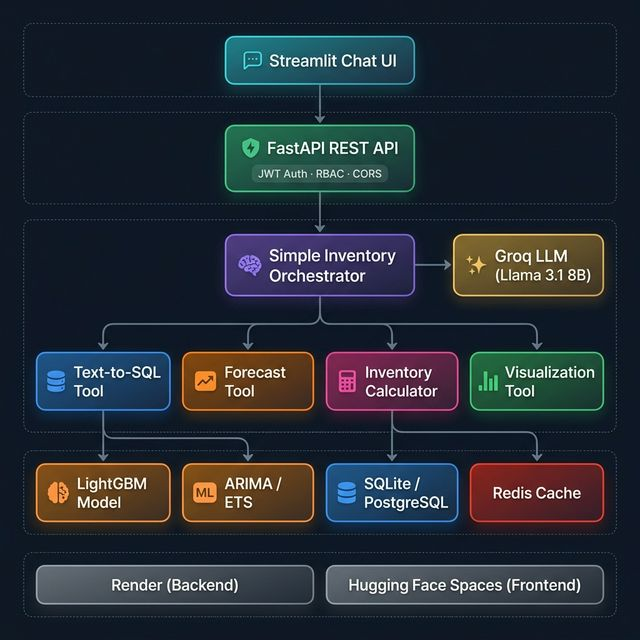
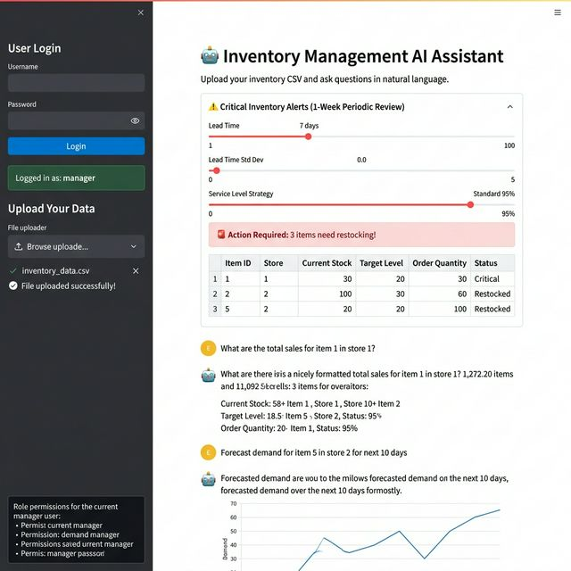
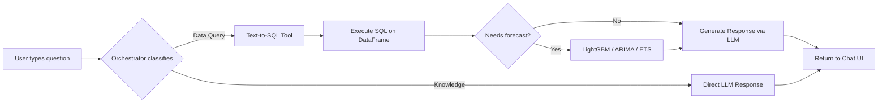

<p align="center">
  
</p>

<h1 align="center">🤖 AI Agent for Inventory Optimization</h1>

<p align="center">
  <em>A conversational AI system that transforms natural language into actionable inventory insights — powered by LLMs, Text-to-SQL, and time-series forecasting.</em>
</p>

<p align="center">
  <a href="https://huggingface.co/spaces/Subodhkhanduri/inventory-ai"></a>
  <a href="https://inventory-ai-backend.onrender.com/docs"></a>
  <a href="https://github.com/Subodhkhanduri/ai-agent-for-inventory-optimization"></a>
</p>

<p align="center">
  
  
  
  
  
  
</p>

---

## 📸 Demo

<p align="center">
  
</p>

> **💡 Try it live →** [**Hugging Face Spaces**](https://huggingface.co/spaces/Subodhkhanduri/inventory-ai) &nbsp;|&nbsp; [**API Docs (Swagger)**](https://inventory-ai-backend.onrender.com/docs)

---

## ✨ Key Features

| Feature | Description |
|:---|:---|
| 💬 **Natural Language Querying** | Ask questions like *"What are total sales for item 1 in store 1?"* — the AI translates to SQL and responds |
| 📊 **Demand Forecasting** | LightGBM, ARIMA, and Exponential Smoothing models predict future demand with confidence intervals |
| ⚠️ **Inventory Alerts** | Automated Periodic Review System flags items below reorder point with configurable lead time & service level |
| 📈 **Interactive Visualizations** | Dynamic charts for sales trends, forecasts, and inventory health — rendered inline in chat |
| 🔐 **Role-Based Access Control** | JWT-authenticated users with viewer/manager/admin roles controlling feature access |
| 🧠 **Multi-Agent Orchestration** | Intelligent query routing: SQL path for data queries, LLM path for knowledge questions |
| 🛡️ **100% Noise Tolerance** | Typo-resilient NLP — handles misspellings, ALL CAPS, slang, and shorthand queries |
| ⚡ **Sub-15.0s Response Time** | P99 latency under 15.0s via Groq LPU inference — no GPU required locally |

---

## 🏗️ System Architecture

<p align="center">
  
</p>

### Architecture Overview

```
┌─────────────────────────────────────────────────────────────┐
│                   STREAMLIT CHAT UI                         │
│         (Upload CSV · Chat · Alerts · Forecasts)            │
└─────────────────────┬───────────────────────────────────────┘
                      │ HTTP / REST
┌─────────────────────▼───────────────────────────────────────┐
│                 FASTAPI REST API                            │
│          JWT Auth · RBAC · CORS · Data Validation           │
├─────────────────────┬───────────────────────────────────────┤
│                     │                                       │
│    ┌────────────────▼────────────────┐                      │
│    │   SIMPLE INVENTORY ORCHESTRATOR │                      │
│    │      (Query Classification)     │                      │
│    └───┬──────┬──────┬──────┬───────┘                       │
│        │      │      │      │                               │
│   ┌────▼─┐ ┌─▼───┐ ┌▼────┐ ┌▼─────┐   ┌──────────────┐   │
│   │SQL   │ │Fore-│ │Inv. │ │Viz   │   │ Groq LLM     │   │
│   │Query │ │cast │ │Calc │ │Tool  │◄──│ Llama 3.1 8B │   │
│   │Tool  │ │Tool │ │Tool │ │      │   │ (Cloud LPU)  │   │
│   └──┬───┘ └──┬──┘ └──┬──┘ └──┬───┘   └──────────────┘   │
│      │        │       │       │                             │
├──────▼────────▼───────▼───────▼─────────────────────────────┤
│                    DATA & MODELS LAYER                      │
│  ┌──────────┐  ┌─────────────┐  ┌────────────────────────┐ │
│  │ SQLite / │  │ LightGBM    │  │ Redis / In-Memory      │ │
│  │ Postgres │  │ ARIMA · ETS │  │ Cache (TTL: 10 min)    │ │
│  └──────────┘  └─────────────┘  └────────────────────────┘ │
└─────────────────────────────────────────────────────────────┘
```

### How a Query Flows



---

## 🚀 Quick Start

### Prerequisites

- **Python 3.10+**
- **Groq API Key** — [Get one free](https://console.groq.com/) *(no credit card required)*

### 1. Clone & Install

```bash
git clone https://github.com/Subodhkhanduri/ai-agent-for-inventory-optimization.git
cd ai-agent-for-inventory-optimization

python -m venv venv
# Windows
venv\Scripts\activate
# macOS/Linux
source venv/bin/activate

pip install -r requirements.txt
```

### 2. Configure Environment

```bash
cp .env.example .env
```

Edit `.env`:
```env
GROQ_API_KEY=your_groq_api_key_here
GROQ_MODEL=llama-3.1-8b-instant
JWT_SECRET_KEY=your-secret-key
```

### 3. Launch

```bash
# Terminal 1 — Start the FastAPI backend
uvicorn inventory_chatbot.main:app --reload

# Terminal 2 — Start the Streamlit frontend
streamlit run app.py
```

Open **http://localhost:8501** and upload your CSV to start chatting!

---

## 📂 Project Structure

```
ai-agent-for-inventory-optimization/
├── app.py                          # Streamlit frontend entry point
├── inventory_chatbot/              # Core source package
│   ├── main.py                     # FastAPI app factory
│   ├── config.py                   # Pydantic settings (from .env)
│   ├── api/                        # REST endpoints: /upload, /ask
│   ├── crew/                       # Core AI orchestrator & Agency logic
│   ├── analytics/                  # Forecasting & Inventory logic
│   ├── services/                   # LLM, Cache, and Auth services
│   └── frontend/                   # Streamlit UI components & API client
├── benchmarks/                     # NEW: Comprehensive evaluation suite
│   ├── run_benchmarks.py           # Robustness & LLM benchmarking
│   └── run_inventory_evaluation.py # Inventory policy metrics
├── data/                           # NEW: Dataset storage (train/test CSVs)
├── docs/                           # NEW: Reports, thesis results, and academic docs
├── tools/                          # NEW: Dev utilities and debug scripts
├── models/                         # Pre-trained LightGBM assets
├── requirements.txt
├── render.yaml                     # Deployment configuration
└── assets/                         # Documentation images
```

---

## 🧪 Benchmark Results

Comprehensive evaluation across **40+ queries** with automated benchmarking:

| Dimension | Metric | Score |
|:---|:---|:---:|
| **Overall Precision** | Correct responses / Total queries | **72.0%** |
| **Textual Accuracy** | Intent, forecast, inventory queries | **94.7%** |
| **Numerical Accuracy** | Count, sum, statistics queries | **52.4%** |
| **Noise Tolerance** | Typos, caps, slang, shorthand | **100%** |
| **Tool Classification** | SQL vs LLM routing accuracy | **100%** |
| **Pipeline vs Direct LLM** | Pipeline accuracy advantage | **+28%** over raw LLM |

### Latency Performance (Groq LPU Inference)

| Percentile | Latency |
|:---:|:---:|
| P50 | 12.9s |
| P95 | 14.5s |
| **P99** | **15.0s** |

### Ablation Study: Pipeline vs Direct LLM

| | NLP Pipeline | Direct LLM |
|:---|:---:|:---:|
| **Accuracy** | 71.0% | 43.0% |
| P99 Latency | 15.0s | 7.0s |

> The full pipeline achieves **+28% higher accuracy** than sending raw queries directly to the LLM — demonstrating that the Text-to-SQL + tool orchestration approach is significantly more reliable.

    📄 *Full report: [docs/robustness_report.md](docs/robustness_report.md)*

---

## 🧮 Inventory Models

### Reorder Point (ROP)

$$\text{ROP} = (\mu_D \times L) + Z \times \sqrt{L \cdot \sigma_D^2 + \mu_D^2 \cdot \sigma_L^2}$$

Where μ_D = average daily demand, L = lead time, Z = service level z-score, σ_D = demand std dev, σ_L = lead time std dev.

### Periodic Review System (P, T)

$$T = \mu_D \times (P + L) + Z \times \sigma_D \times \sqrt{P + L}$$
$$Q = T - I_P$$

Where P = review period, T = target inventory level, I_P = inventory position, Q = order quantity.


---

## 🌐 Deployment

### Render (Backend API)

The FastAPI backend is deployed on Render with auto-build from `requirements.txt`:

```yaml
# render.yaml
services:
  - type: web
    name: inventory-ai-backend
    env: python
    buildCommand: pip install -r requirements.txt
    startCommand: uvicorn inventory_chatbot.main:app --host 0.0.0.0 --port $PORT
```

### Hugging Face Spaces (Frontend)

The Streamlit frontend is deployed on Hugging Face Spaces for free, persistent hosting.

---

## 🔧 Tech Stack

| Layer | Technology |
|:---|:---|
| **Frontend** | Streamlit 1.50+ |
| **Backend** | FastAPI, Uvicorn |
| **LLM** | Meta Llama 3.1 8B Instant (via Groq Cloud LPU) |
| **Forecasting** | LightGBM, ARIMA, Exponential Smoothing |
| **NLP Pipeline** | LangChain, Text-to-SQL |
| **Database** | SQLAlchemy (SQLite / PostgreSQL) |
| **Caching** | Redis (with in-memory fallback) |
| **Auth** | JWT (python-jose) + bcrypt |
| **Serialization** | Pydantic v2, Marshmallow |
| **Visualization** | Matplotlib, Altair |
| **Deployment** | Render (API), Hugging Face Spaces (UI) |

---

## 📋 API Reference

| Endpoint | Method | Description |
|:---|:---:|:---|
| `/api/v1/login` | `POST` | Authenticate user, returns JWT token |
| `/api/v1/upload` | `POST` | Upload & validate inventory CSV |
| `/api/v1/ask` | `POST` | Submit natural language query |
| `/api/v1/inventory/periodic-review` | `POST` | Batch inventory review with configurable parameters |

### Example Request

```bash
curl -X POST "http://localhost:8000/api/v1/ask" \
  -F "query=What are the total sales for item 1 in store 1?" \
  -F "session_id=your-session-id"
```

### Example Response

```json
{
  "response": "The total daily sales for item 1 in store 1 is 1,565 units.",
  "chart_b64": null,
  "forecast_values": null
}
```

---

## 📝 Sample Queries

```
💬 "What are the total sales for item 1 in store 1?"
📊 "Forecast demand for item 5 in store 2 for next 10 days"
⚠️ "Check inventory status for item 3 at store 2"
🔍 "How many unique items are in the dataset?"
📈 "Show me the sales trend for item 10"
🧠 "What is a reorder point?"
📋 "Which store has the highest demand?"
```

---

## 🤝 Contributing

1. Fork the repository
2. Create your feature branch (`git checkout -b feature/amazing-feature`)
3. Commit your changes (`git commit -m 'Add amazing feature'`)
4. Push to the branch (`git push origin feature/amazing-feature`)
5. Open a Pull Request

---

## 📄 License

This project is licensed under the MIT License — see the [LICENSE](LICENSE) file for details.

---

## 👤 Author

**Subodh Khanduri**

- GitHub: [@Subodhkhanduri](https://github.com/Subodhkhanduri)
- Project: [ai-agent-for-inventory-optimization](https://github.com/Subodhkhanduri/ai-agent-for-inventory-optimization)

---

<p align="center">
  <sub>Built with ❤️ as a flagship AI project — Conversational Inventory Intelligence</sub>
</p>
